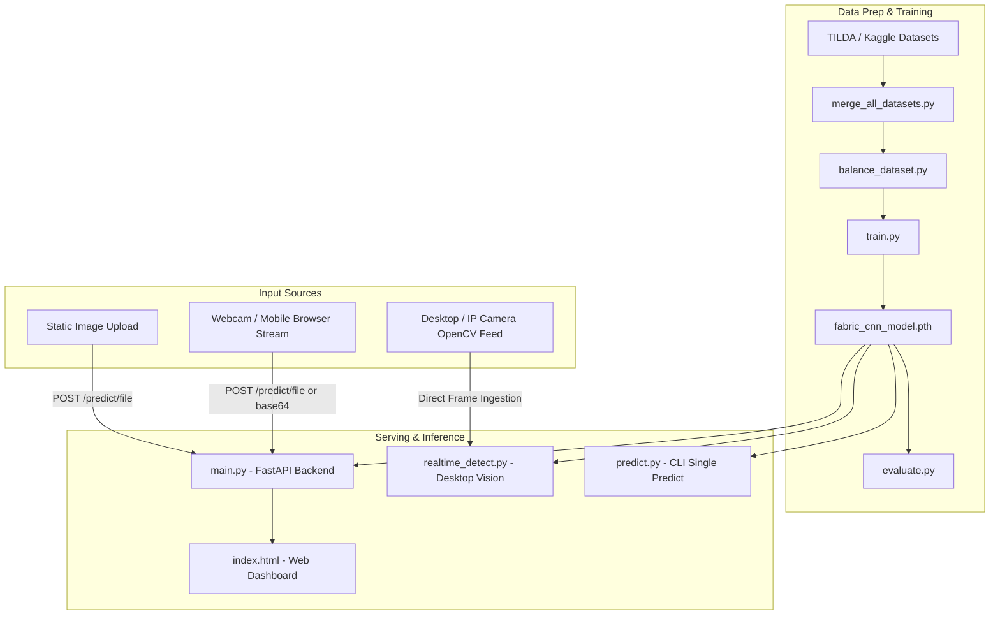

# 🧵 Fabric Defect Detection & Quality Control System

An end-to-end Computer Vision and Deep Learning solution for automated fabric quality inspection. This project classifies textile surfaces into five distinct quality classes (defect-free fabric and various common manufacturing defects) using a custom PyTorch Convolutional Neural Network (FabricCNN), served via a FastAPI REST backend and an interactive web interface with real-time camera support.

---

## 📑 Table of Contents

- [Project Overview](#-project-overview)
- [Defect Classes](#-defect-classes)
- [System Architecture](#-system-architecture)
- [Component Breakdown](#-component-breakdown)
  - [1. Deep Learning Model (`model.py`)](#1-deep-learning-model-modelpy)
  - [2. Dataset Management & Preprocessing](#2-dataset-management--preprocessing)
  - [3. Model Training & Evaluation](#3-model-training--evaluation)
  - [4. Real-Time & CLI Inference](#4-real-time--cli-inference)
  - [5. Backend REST API (`main.py`)](#5-backend-rest-api-mainpy)
  - [6. Web Frontend Interface (`index.html`)](#6-web-frontend-interface-indexhtml)
  - [7. Deployment Configuration](#7-deployment-configuration)
- [Project Directory Structure](#-project-directory-structure)
- [Installation & Setup](#-installation--setup)
- [Usage Guide](#-usage-guide)
  - [Running the Web Application](#running-the-web-application)
  - [Running Real-Time Camera Detection](#running-real-time-camera-detection)
  - [Running CLI Prediction](#running-cli-prediction)
  - [Training from Scratch](#training-from-scratch)
  - [Evaluating the Model](#evaluating-the-model)
- [API Reference](#-api-reference)
- [Deployment on Cloud (Render)](#-deployment-on-cloud-render)

---

## 🔍 Project Overview

In textile manufacturing, manual visual inspection is labor-intensive, subjective, and prone to fatigue. This Quality Control system automates defect detection through:
- **Custom CNN Architecture**: A lightweight, fast 3-stage PyTorch CNN specifically designed for 64x64 grayscale fabric images.
- **FastAPI Web Service**: High-performance asynchronous REST API supporting multiple input formats (file upload, base64 data URLs, and webcam frames).
- **Responsive UI & Real-Time Webcam**: Interactive client with front/rear camera switching, live confidence metrics, and probability distribution visualization.
- **Robust Desktop Vision Pipeline**: OpenCV-based real-time detection with camera discovery, automatic warmup, brightness filtering, and Region of Interest (ROI) variance checking.

---

## 🏷️ Defect Classes

The model classifies fabric inspection frames into 5 categories:

| Class ID | Class Name | Description |
| :--- | :--- | :--- |
| `0` | **`good`** | High-quality fabric free of visible defects or surface anomalies. |
| `1` | **`hole`** | Structural tears, punctures, or missing weave areas. |
| `2` | **`objects`** | Foreign debris, loose particles, or foreign contaminants on the fabric. |
| `3` | **`oil_spot`** | Machine oil stains, chemical discoloration, or liquid smudges. |
| `4` | **`thread_error`** | Missing warp/weft yarns, tension irregularities, or slub/yarn flaws. |

---

## 🏗️ System Architecture



---

## 🧩 Component Breakdown

### 1. Deep Learning Model (`model.py`)
- **Class**: `FabricCNN(nn.Module)`
- **Input Dimensions**: `(Batch, 1, 64, 64)` (Single-channel Grayscale)
- **Architecture**:
  - **Conv Layer 1**: `Conv2d(1, 32, kernel=3, padding=1)` + `ReLU` + `MaxPool2d(2, 2)` $\rightarrow$ Output: `(32, 32, 32)`
  - **Conv Layer 2**: `Conv2d(32, 64, kernel=3, padding=1)` + `ReLU` + `MaxPool2d(2, 2)` $\rightarrow$ Output: `(64, 16, 16)`
  - **Conv Layer 3**: `Conv2d(64, 128, kernel=3, padding=1)` + `ReLU` + `MaxPool2d(2, 2)` $\rightarrow$ Output: `(128, 8, 8)`
  - **Flattening**: $128 \times 8 \times 8 = 8192$ feature dimensions
  - **Fully Connected 1**: `Linear(8192, 256)` + `ReLU`
  - **Fully Connected 2**: `Linear(256, 5)` (Raw Logits for the 5 defect classes)
- **Weights File**: `fabric_cnn_model.pth`

---

### 2. Dataset Management & Preprocessing

- **`merge_all_datasets.py`**:
  - Unifies multi-source datasets (TILDA dataset and Kaggle defect repositories).
  - Recursively maps disparate folder conventions into standardized labels:
    - `"good"`, `"captured"` $\rightarrow$ `good`
    - `"hole"` $\rightarrow$ `hole`
    - `"stain"` $\rightarrow$ `stain`
    - `"horizontal"` $\rightarrow$ `missing_weft`
    - `"vertical"` $\rightarrow$ `missing_warp`
    - `"lines"` $\rightarrow$ `thick_thin`
  - Outputs merged imagery into `combined_dataset/train/`.

- **`balance_dataset.py`**:
  - Resolves class imbalance in `combined_dataset/train`.
  - Enforces a uniform target count (default: 500 samples per class) using:
    - **Undersampling**: Randomly removes excess samples for majority classes.
    - **Oversampling**: Duplicates randomized samples for minority classes.

---

### 3. Model Training & Evaluation

- **`train.py`**:
  - **Data Augmentation**: Incorporates `RandomHorizontalFlip`, `RandomVerticalFlip`, and `RandomRotation(20)` with normalization `(0.5, 0.5)`.
  - **Class Weighting**: Uses cost-sensitive loss `class_weights = torch.tensor([1.0, 6.0, 3.0, 3.0, 3.0])` inside `CrossEntropyLoss` to heavily penalize misclassification of critical defects like holes and thread errors.
  - **Optimizer**: Adam with learning rate `0.001`, batch size `16`, and 30 training epochs.
  - **Artifact Generation**: Exports state dictionary to `fabric_cnn_model.pth`.

- **`evaluate.py`**:
  - Loads the test split (`dataset/test`) and executes evaluation in inference mode (`torch.no_grad()`).
  - Generates a confusion matrix using Scikit-Learn.
  - Plots a heatmap using Seaborn and Matplotlib to verify class precision and recall.

---

### 4. Real-Time & CLI Inference

- **`realtime_detect.py`**:
  - Dedicated OpenCV script for continuous, real-time desktop inspection.
  - **Multi-Backend Discovery**: Iterates across indices (0–4) and OpenCV backends (`CAP_ANY`, `CAP_MSMF`, `CAP_V4L2`, `CAP_DSHOW`) to prevent green/black screen capture bugs.
  - **Camera Warmup & Brightness Validation**: Ensures sensor stabilization by checking average pixel luminosity.
  - **Center ROI Focus**: Crops the central 40% region (`w*0.3` to `w*0.7`, `h*0.3` to `h*0.7`).
  - **Variance Check**: Computes pixel standard deviation ($\sigma \ge 15$) to detect whether fabric is present before running CNN inference.
  - **Visual Feedback**: Annotates the live video feed with bounding boxes and color-coded labels + confidence scores.
  - **IP Camera Support**: Ready to ingest RTSP/HTTP streams (e.g., Android IP Webcam).

- **`check_Camera.py`**:
  - Diagnostic utility to probe hardware and report available OpenCV camera index numbers.

- **`predict.py`**:
  - Standalone script demonstrating single-image file inference (`test2.jpeg`).

---

### 5. Backend REST API (`main.py`)

FastAPI application providing asynchronous endpoints for prediction and web service hosting:

- **Lifespan Manager**: Loads `fabric_cnn_model.pth` into memory on startup for zero-latency inference.
- **CORS Middleware**: Permissive configuration (`*`) allowing seamless integration with external dashboards.
- **Endpoints**:
  - `GET /`: Serves the web frontend (`index.html`).
  - `GET /health`: Model status and service liveness probe.
  - `GET /classes`: Returns list of detectable class names.
  - `POST /predict/file`: Accepts multipart form uploads (`UploadFile`).
  - `POST /predict/base64`: Accepts base64 encoded data URI strings (with automatic header stripping).
  - `POST /predict/camera-frame`: Endpoint tailored for streaming/webcam clients, returning confidence, label, class ID, and class probabilities.

---

### 6. Web Frontend Interface (`index.html`)

A single-page web interface:
- **Interactive File Uploader**: Drag-and-drop or file picker with instant image preview.
- **Camera Capture Engine**: In-browser camera streaming with camera selection (`user` front camera vs. `environment` rear camera) via HTML5 `MediaDevices.getUserMedia()`.
- **Real-Time Visualizer**:
  - Primary predicted class and confidence percentage badge.
  - Dynamic gradient breakdown progress bars for all 5 defect categories.
  - Automatic API health indicator badge.
- **Adaptive Network Routing**: Automatically detects localhost vs. production URL environments for API calls.

---

### 7. Deployment Configuration

- **`requirements.txt`**: Lean dependency manifest configured with CPU-only PyTorch wheels (`--extra-index-url https://download.pytorch.org/whl/cpu`) and `opencv-python-headless` for cloud container compatibility.
- **`Procfile`**: Process definition file for Render / Heroku PaaS (`web: uvicorn main:app --host 0.0.0.0 --port $PORT`).
- **`runtime.txt`**: Specifies Python runtime version (`python-3.10.12`).
- **`DEPLOY.md`**: Complete step-by-step instructions for 1-click cloud deployment.

---

## 📁 Project Directory Structure

```text
Quality_Control/
├── fabric_cnn_model.pth      # Pretrained PyTorch model weights
├── model.py                  # FabricCNN neural network architecture definition
├── main.py                   # FastAPI application & REST endpoint router
├── index.html                # Frontend web dashboard (UI + Webcam controls)
├── realtime_detect.py        # Desktop live OpenCV camera inspection tool
├── check_Camera.py           # Camera device scanner utility
├── predict.py                # Standalone single image prediction script
├── train.py                  # Training pipeline with data augmentation
├── evaluate.py               # Confusion matrix & model evaluation script
├── balance_dataset.py        # Dataset balancing (undersampling/oversampling)
├── merge_all_datasets.py     # Multi-dataset merger & label mapper
├── DEPLOY.md                 # Cloud deployment guide (Render)
├── Procfile                  # Cloud web process entrypoint
├── runtime.txt               # Python runtime specification
├── requirements.txt          # Python package dependencies
├── .gitignore                # Git ignore rules for datasets, cache, models
└── README.md                 # Project documentation
```

---

## 🚀 Installation & Setup

### Prerequisites
- Python 3.9, 3.10, or 3.11
- A webcam (optional, for real-time video inspection)

### 1. Clone the Repository
```bash
git clone https://github.com/YOUR_USERNAME/fabric-defect-detection.git
cd fabric-defect-detection
```

### 2. Create and Activate a Virtual Environment
```bash
# Windows
python -m venv venv
venv\Scripts\activate

# Linux / macOS
python3 -m venv venv
source venv/bin/activate
```

### 3. Install Dependencies
```bash
pip install -r requirements.txt
```

---

## 💻 Usage Guide

### Running the Web Application
Start the FastAPI server:
```bash
python main.py
```
Or with Uvicorn directly:
```bash
uvicorn main:app --reload --host 0.0.0.0 --port 8000
```
Open your browser and navigate to:
```
http://localhost:8000
```

---

### Running Real-Time Camera Detection
To run desktop camera inspection with live bounding boxes and defect alerts:
```bash
python realtime_detect.py
```
*Note: Press `ESC` to exit the camera window.*

To check which camera indices are available on your system:
```bash
python check_Camera.py
```

---

### Running CLI Prediction
To test a single image file (`test2.jpeg`):
```bash
python predict.py
```

---

### Training from Scratch
Ensure your dataset is organized in `dataset/train` and `dataset/test`:
```
dataset/
├── train/
│   ├── good/
│   ├── hole/
│   ├── objects/
│   ├── oil_spot/
│   └── thread_error/
└── test/
    ├── good/
    ├── hole/
    ├── objects/
    ├── oil_spot/
    └── thread_error/
```

Run training:
```bash
python train.py
```

---

### Evaluating the Model
To compute test metrics and render the confusion matrix:
```bash
python evaluate.py
```

---

## 📡 API Reference

### 1. Health Check
- **URL**: `/health`
- **Method**: `GET`
- **Response**:
```json
{
  "status": "healthy",
  "model_loaded": true
}
```

### 2. Get Defect Classes
- **URL**: `/classes`
- **Method**: `GET`
- **Response**:
```json
{
  "classes": ["good", "hole", "objects", "oil_spot", "thread_error"]
}
```

### 3. Predict from File
- **URL**: `/predict/file`
- **Method**: `POST`
- **Payload**: `multipart/form-data` with key `file` (Image)
- **Response**:
```json
{
  "predicted_class": "good",
  "confidence": 0.9854,
  "probabilities": {
    "good": 0.9854,
    "hole": 0.0031,
    "objects": 0.0022,
    "oil_spot": 0.0041,
    "thread_error": 0.0052
  }
}
```

### 4. Predict from Base64 Image
- **URL**: `/predict/base64`
- **Method**: `POST`
- **Payload**:
```json
{
  "image": "data:image/jpeg;base64,/9j/4AAQSkZJRgABAQ..."
}
```

---

## ☁️ Deployment on Cloud (Render)

1. Push this repository to GitHub.
2. Sign in to [Render](https://render.com) and create a **New Web Service**.
3. Link your GitHub repository.
4. Set the following configuration:
   - **Environment**: `Python 3`
   - **Build Command**: *(leave blank or `pip install -r requirements.txt`)*
   - **Start Command**: `uvicorn main:app --host 0.0.0.0 --port $PORT`
5. Click **Create Web Service**. Your API and frontend will be live in a few minutes.

---

## 📄 License & Attribution
Developed for Automated Quality Assurance in Textile Manufacturing.
